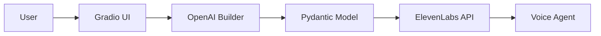

# SalesAI 📞

An AI-powered builder for creating and deploying lead qualification voice agents using OpenAI Structured Outputs and ElevenLabs.

# Table of Contents

- [About the Project](#about-the-project)
- [Getting Started](#getting-started)
- [Architecture](#architecture)
- [Design Decisions](#design-decisions)
- [Future Improvements](#future-improvements)
- [Resources & References](#resources--references)

# About the Project

SalesAI is a proof-of-concept application that allows users to build lead qualification voice agents entirely through natural language.

Rather than manually configuring an AI assistant, users simply describe the desired behavior through a chat interface. An OpenAI-powered builder extracts the required information into a structured configuration using Pydantic and OpenAI Structured Outputs, which can then be deployed directly to ElevenLabs with a single click.

The project demonstrates how LLMs can act as AI builders, allowing users to create production-ready voice agents without manually configuring prompts or conversation settings.

# Getting Started

## Requirements

- OpenAI API Key
- ElevenLabs API Key
- Docker

## Installation

### 1. Clone the repository

```bash
git clone https://github.com/itaybaror/SalesAI.git
cd SalesAI
```


### 2. Create a `.env` file in the project root containing:

```text
OPENAI_API_KEY=your_openai_api_key
OPENAI_MODEL=gpt-5-mini
ELEVENLABS_API_KEY=your_elevenlabs_api_key
ELEVENLABS_VOICE_ID=your_elevenlabs_voice_id
```

- `OPENAI_API_KEY` – Your OpenAI API key.
- `OPENAI_MODEL` – The OpenAI model used by the builder (e.g. `gpt-5-mini`).
- `ELEVENLABS_API_KEY` – Your ElevenLabs API key.
- `ELEVENLABS_VOICE_ID` – *(Optional)* The ElevenLabs voice ID used for deployed agents. Leave this blank to use the default voice.

### 3. Build the Docker image

```bash
docker build -t sales-ai .
```

### 4. Run the container

```bash
docker run --rm --env-file .env -p 7860:7860 sales-ai
```

### 5. Open your browser and navigate to:

```
http://localhost:7860 
```

# Architecture




## Workflow

1. The user describes the desired voice agent through the chat interface.
2. The builder extracts the required information into a strongly typed Pydantic model.
3. The generated configuration is displayed for review.
4. Once complete, the assistant is deployed directly to ElevenLabs.

# Design Decisions

- **Gradio** provides a simple interface while keeping frontend code to a minimum.
- **OpenAI Structured Outputs + Pydantic** guarantee a predictable assistant configuration without manual JSON parsing.
- **Local application state** keeps the application lightweight and removes the need for a database.
- **ElevenLabs** handles voice agent execution while SalesAI focuses solely on agent creation.

# Future Improvements

SalesAI was intentionally built as a focused proof of concept demonstrating how an LLM can create and deploy voice agents through natural language. If developed into a production platform, it would become an end-to-end outbound sales solution.

Users would be able to build a voice agent through chat, upload a CSV of leads, launch outbound calling campaigns through ElevenLabs, automatically qualify prospects, and book meetings using calendar integrations such as Google Calendar or Cal.com. The platform could also provide campaign analytics, CRM integrations (e.g., HubSpot and Salesforce), agent templates, and conversation history, allowing businesses to create, deploy, and manage voice sales agents from a single interface.

# Resources & References

### OpenAI: https://platform.openai.com/docs

### ElevenLabs https://elevenlabs.io/docs

### Gradio https://www.gradio.app/docs

### Docker https://docs.docker.com